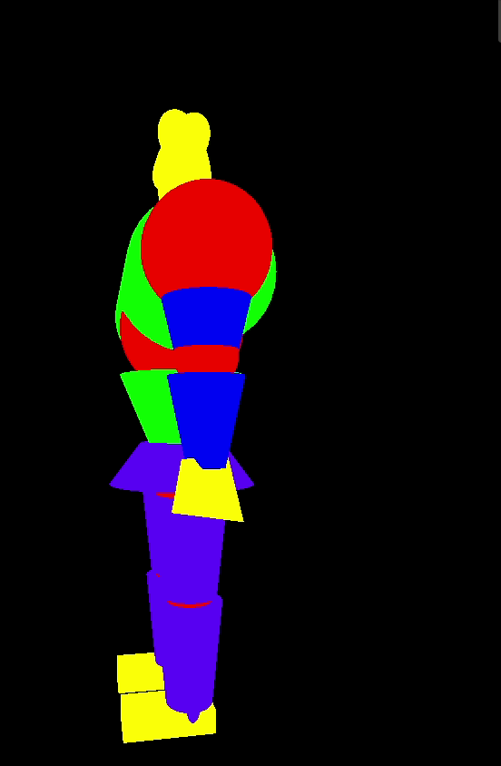
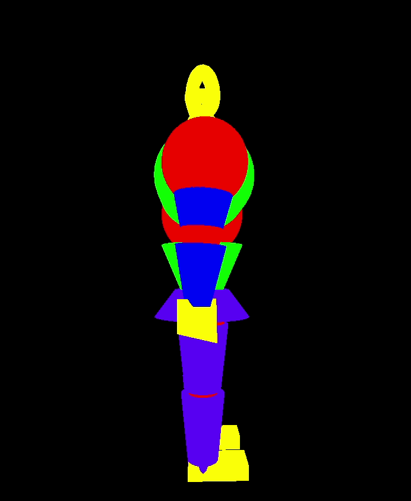
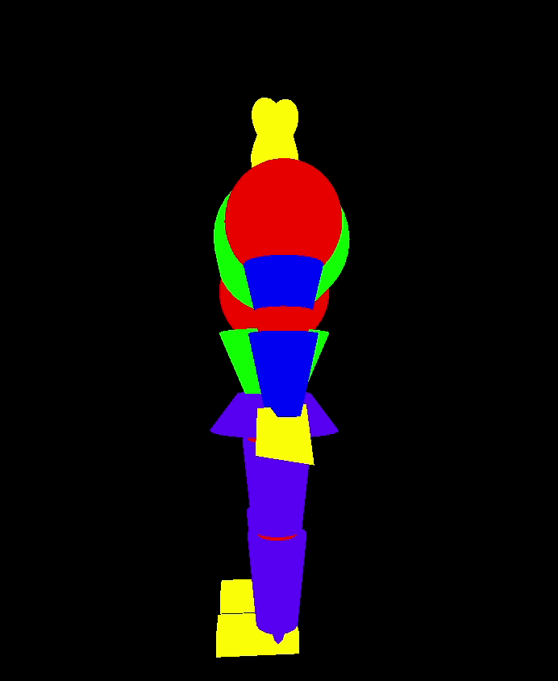
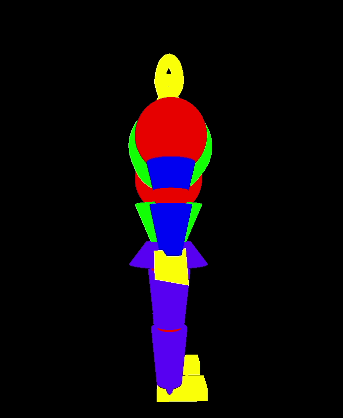
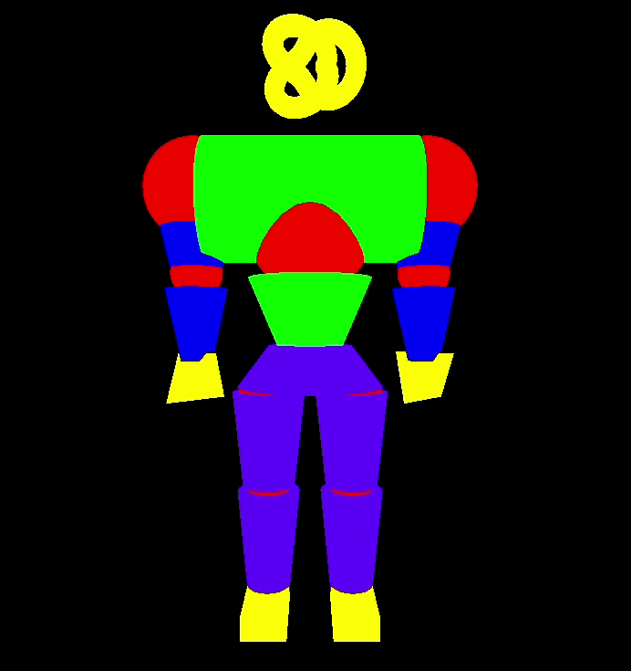
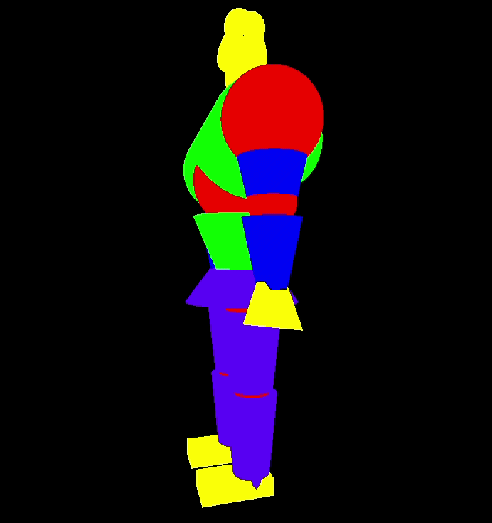
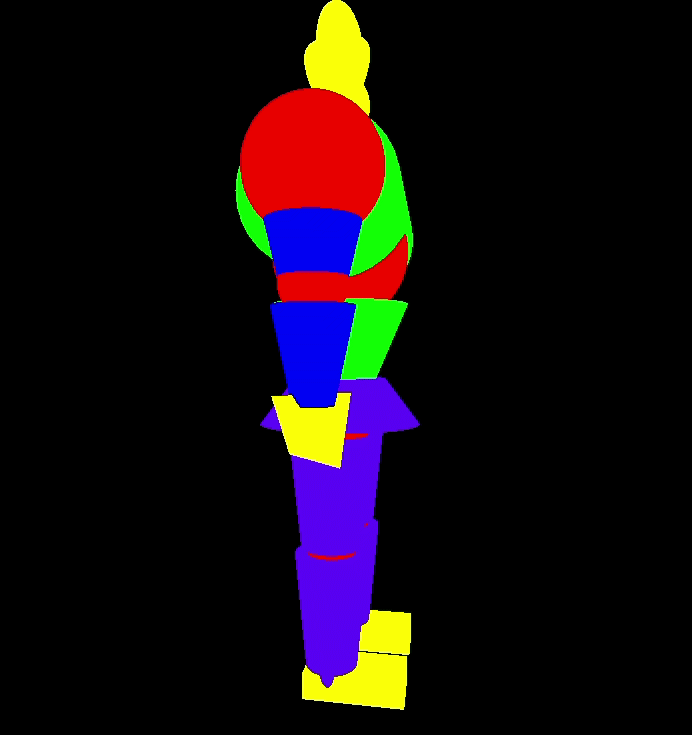

# Manual

## Controles Básicos

- **Setas**: Controlam a rotação do corpo todo do monstro, possibilitando a visão de todos os ângulos

---

## Controle dos Braços

- **Tecla Q/Shift+Q**: Movimentam o braço _esquerdo_ na direção lateral.
  - 

- **Tecla W/Shift+W**: Movimentam o braço _esquerdo_ na direção frontal.
  - 
  
- **Tecla E/Shift+E**: Movimentam o braço _direito_ na direção frontal.
  - 
  
- **Tecla R/Shift+R**: Movimentam o braço _direito_ na direção lateral.
  - 
  
- **Tecla T/Shift+T**: Movimentam o antebraço _esquerdo_.
  - 
  
- **Tecla Y/Shift+Y**: Movimentam o antebraço _direito_.
  - 

---
  
## Controle das Pernas

- **Tecla A/Shift+A**: Movimentam a coxa _esquerda_ na direção lateral.
  - 
  
- **Tecla S/Shift+S**: Movimentam a coxa _esquerda_ na direção frontal.
  - 
  
- **Tecla D/Shift+D**: Movimentam a coxa _direita_ na direção frontal.
  - 
  
- **Tecla F/Shift+F**: Movimentam a coxa _direita_ na direção lateral.
  - 
  
- **Tecla G/Shift+G**: Movimentam a perna _esquerdo_.
  - 
  
- **Tecla H/Shift+H**: Movimentam a perna _direito_.
  - 
