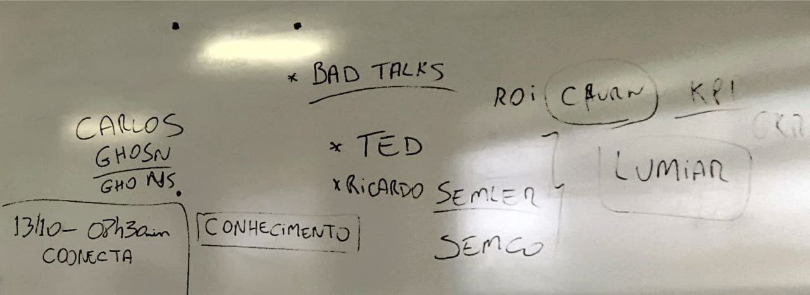

# Aula 3 - 06/10/2022

## Revisão aula Passada:

- Trabalho vs Emprego;
    - Emprego: carteira de trabalho, vínculo.
    - Trabalho: sempre vai ter, uma atividade a ser desenvolvida.
- Problemas da automação: Diminuição de empregos, é necessário empreender pra gerar empregos para todo mundo;
- Empreendedorismo pode ser ensinado
    - Quanto mais a gente aprende e presencia, mais qualificados em empreendedorismo. É necessário situações específicas que façam desenvolver capacidades ("jeitinho");
- Educação infantil: Desde pequeno ter competências empreendedoras.
- Condições básicas para u mambiente empreendedor:
    1. **Motivação:** motivação frente a tarefas (ambiente com estimulos, porém é o individuo que vai realizar o match) -> motivação é intrinseca.
    2. **Recompensa:** atrelado a motivação, reconhecimento, dinheiro, cargo, etc. Tapinha nas costas pode limitar a motivação depois de um tempo.
    3. **Conhecimento:** `Know how`, `Life long learning`. Questão do aprender a desaprender, mudar forma de como fazer as coisas.
        - Hoje existe muito conhecimento disponível, o problema é filtrar o que é bom ou ruim.
        - Ciência é base necessária.
    4. **Ambiente:** necessário um local que gere as condições necessárias para o empreendedorismo.

- **Livro**: Virando a Própria mesa (TED: Ricardo Semler)

---

## Visões do Empreendedorismo

### Visão Econômica:
- Começou com mais impacto esse estudo em 1940. (Cantillon, Say e Schumpeter)
- como o empreendedorismo impacta na economia. "Riqueza das Nações, Adam Smith" -> Pq alguns países são ricos e outros pobres. 
- Brasil: Colônia de Exploração
- EUA: Colônica de Habitação
- "Empreendedor é o agente da destruição criativa"
    - Ford por exemplo, acaba com o mercado dos cavalos a produzir carros em massa.
- Estudos de o que tinham de especial nos empreendedores, pra ver as principais características comportamentais (Na época as pessoas acreditavam que a pessoa nascia com as habilidades de empreendedodr);

- Fases distintas do empreendedorismo:
    1. Reconhecimento de uma oportunidade;
    2. decisão de ir em frente e reunir os recursos iniciais;
    3. lançamento de um novo empreendedorismo;
    4. construção do sucesso e aproveitamento das recompensas.

- Basicamente: Estudo de como surge o negócio, como se desenvolve, características de empreendedor, comportamentos, etc.
- Estrutura ambiental: apoio em situações de crise (ex da pandemia);
- Assumir os riscos financeiros.

- Desenvolver plano de negócio:
    1. indentificar e avaliar a oportunidade;
    2. Desenvolver o plano de negócios;
    3. Determinar e captar os recursos necessários;
    4. Gerenciar a empresa criada;
- Associam empreendedorismo com inovação, aspectos criativos e intuitivos.

### Visão Comportamental:
- focavam no comportamento e características dos empreendedores.
- Mapeamento dos comportamentos através de observação.
- Principais características que se apresentam em empreendedores, tá nos slides.
- Sem relacionamento não tem empreendedorismo.
- Assumir as responsabilidades.

### Uma outra Visão:
- Olhar pro individuo e pro ambiente.
- O ambiente, ou contexto, pode potencializar o espírito empreendedor.
- Metas individuais -> metas coletivas.
- A organização é maior que as pessoas. A soma do todo é maior que as partes.
- Vertente do Contexto;
- é necessário colocar em ação as competências empreendedoras;
- Educação empreendedora é uma maneira de desenvolver o indivíduo em toda sua amplitude.
- Empreendedor é aquele que faz mais que o mínimo, se dedica, etc.
---

### Foto do quadro:
