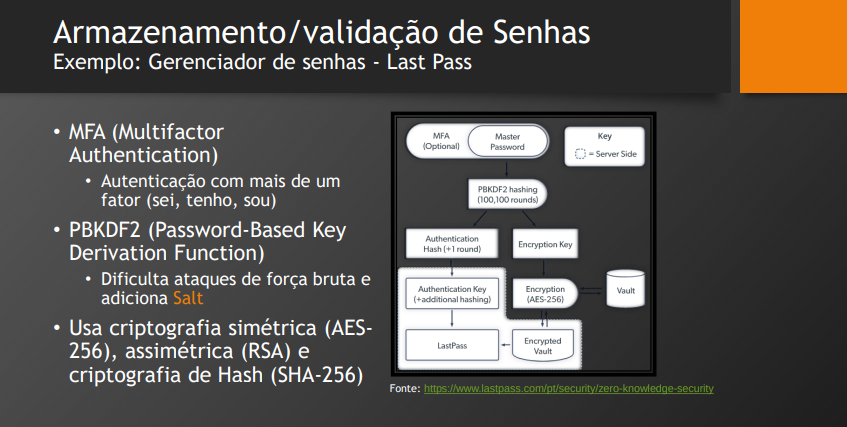

# Aula 09/11

## Review:

- HTTPS (TLS): Web
- SSH: Controle de máquinas a distância
- SFTP (SSH): Transferência de arquivos

---

- Assimétrico -> RSA;
- Simétrico -> AES

**Certificado Digital** -> Documento Digital
- Assinatura Digital: Faz a criptografia do documento com a chave privada, assim, para provar que o documento é assinado, basta usar a chave pública para verificar.

---

## Funções Hash

### Função Hash

- algoritmo **determínistico** que mapeia dados de entrada de comprimento (tamanho) variável para um dado de saída de comprimento fixo (chamado digest).
- deve aceitar qualquer tamanho de dados de entrada, mas a saída precisa ser fixa.
    - Ex: SHA258, vai ter uma entrada de tamanho variável, porém a saída terá 258 bits obrigatóriamente.
    - **Determinístico**: a saída vai ser sempre a mesma para a mesma saída, sem elementos aleatórios no processo.
    - Em geral, esses algoritmos não são reversíveis, logo se perde informação no processamento. Um processo de via única. Não consigo restaurar dado de entrada a partir de seu hash (digest).
    - Utilizada para resumo (indentificação);
- Integridade: Garantir que um dado que foi transmitido sem alterações.
    - Nesse caso, é enviado um arquivo junto com a chave hash (usando uma assinatura digital para garantir a autenticidade), assim é possível passar o arquivo em no mesmo algoritmo de hash pra gerar um hash e podemos comparar os hashs pra verificar se o arquivo não foi modificado.
    - A ideia é que a chave hash vai gerar uma saída diferente para cada entrada.
- Para isso é necessário que o algoritmo seja eficiente e obeceça as seguintes propriedades:
    - **Resistência à pré-imagem:** reversão da função deve ser inviável computacionalmente.
    - **Resistência à segunda pré-imagem:** dado uma entrada, ser muito difícil encontrar uma entrada diferente que gere a mesma saída.
    - **Resistência à colisão:** deve ser muito difícil encontrar dois dados de entrada que produzam a mesma saída na função.
- São resistentes, mas não infalíveis.

### Algoritmo de Hash

1. Divide a entrada em blocos de tamanho pré-definido.
2. Combina uma semente fixa com o primeiro bloco e faz várias operações (+, -, /, *, operações bit a bit)
3. esse bloco é juntado com o próximo bloco, e a mesma série de operações é realizada, até que ele obtenha o tamanho definido. Isso se repete para todos os blocos que vão sendo adicionados.
- Exemplos que utilizam essa ideia: BLAKE, GOST, HAVAL, **MD**, RIPEMD, **SHA**, Tiger e Whirlpool;
    - MD (MD5): tem problemas na resistência a colisão, então para segurança se usa mais o **SHA**.

### Aplicações da criptografia Hash

- Verificação de integridade.
- Gerar assinaturas digitais e verificação de integridade. (faz a criptografia assimétrica {RSA} somente no hash {resumo})
- Armazenar senhas de forma segura e verificar uso.
    - senhas armazenadas em hash, assim mesmo com vazamento não se sabe a senha, só é possível conferir se a senha está correta a partir do hash.
- Gerar identificadores únicos
- Gerar números pseudoaleatórios
- prova-de-trabalho (proof-of-work), princípio da mineração de criptomoedas.
  
### Message Digest (MD2, MD4, MD5, MD6)

- criado pelo estadounidense Ronald Rivest.
- MD5 é mais eficiente que SHA, porém tem falha na resistência a colisão, então temos MD6, porém é menos eficiente que o SHA.

### Secure Hash Function (SHA-0, SHA-1, SHA-2, SHA-3)
- definido pelo NIST (National Institute of Standards and Technology)
- SHA-2 é o padrão utilizado.
    - Quanto maior o tamanho do bloco, maior o custo de preocessamento.
    - não é resistente a ataques de extensão de Hash (ataque de casos específicos).
- SHA-3 é mais custoso, por isso não é muito utilizado na prática.

---

## Senhas e Salt

- Ideia de armazenar informações confidenciais de forma segura.

### Armazenamento/validação de Senhas
- Exemplo: Gerenciador de senhas - Last PassNational Institute of
Standards and Technology

### Funcionamento do Salt

- Com senhas padrões (simples), é possível verificar os resultados de chave hashs que são iguais. O que acontece é que existe um banco que salva os hashs das senhas padrões mais utilizadas.
- A ideia do salt é adicionar um dado aleatório a uma entrada sensível
- Para cada usuário é gerado um código aleatório (o Salt), pra ser utilizado para combinar com a entrada do hash. Assim não há como identificar se as senhas são as mesmas a partir do hash.

--- 

## Atividades

1. Cite os cinco principais pilares da segurança da informação e explique
resumidamente o que cada um deles representa.
- **Disponibilidade:** precisa estar disponível quando necessário.
- **Confidencialidade:** deve estar acessível apenas para quem tem permissão.
- **Integridade:** Informação se mantém fiel ao conteúdo de criação.
- **Autenticidade:** A autoria de um dado pode ser verificada/garantida.
- **Irretratabilidade:** O autor de uma informação não pode negar a sua autoria.

2. Explique a estratégia utilizada por cada um dos tipos de criptografia a seguir:
transposição, substituição e esteganografia.
- **Transposição:** Não substitui os caracteres na etapa de criptografia, apenas os embaralha através de uma chave.
- **Substituição:** Ideia de substituir os caracteres de entrada por novos caracteres para a criptografia. (Cifra de Cesar)
- **Esteganografia:** Esconder dados em locais onde não se esperaria que esses dados sejam encontrados, em imagens, áudios, vídeos, etc. (ocultar, mensagem subliminar)

3. Indique corretamente as características da criptografia (A) assimétrica, (B)
simétrica ou (C) para características que são de ambas.
- B B A C A A B A B A (Cerificado digital pode usar os dois)

4. Cite as principais características desejadas para um algoritmo de Hash
criptográfico. 
- Precisa ser eficiente coputacionalmente e ter as seguintes características:
    - **Resistência à pré-imagem:** reversão da função deve ser inviável computacionalmente.
    - **Resistência à segunda pré-imagem:** dado uma entrada, ser muito difícil encontrar uma entrada diferente que gere a mesma saída.
    - **Resistência à colisão:** deve ser muito difícil encontrar dois dados de entrada que produzam a mesma saída na função.
    - Tamanho fixo de saída

5. Explique o que é um certificado digital e dê exemplos de onde podemos utilizá-lo.
- É uma forma de autenticidade para identificar pessoas físicas e júridicas. Pode ser usado, por exemplo, para uma assinatura digital para comprovar que um documento foi assinado digitalmente, Notas Fiscais Eletrônicas, dentro do HTTPS, eCPF, eCNPJ.

6. Assinale (F) para as afirmações falsas e (V) para as verdadeiras

- **(V)** MD5 e SHA são funções de resumo de mensagem (funções hash). Esses algoritmos têm
a finalidade de garantir a integridade de mensagens de tamanho arbitrário
- **(V)** No padrão RSA, a assinatura digital é um código de verificação concatenado a uma
mensagem que é o hash da mensagem cifrada com a chave privada de quem emite a
mensagem
- **(F)** Considerando-se os algoritmos de criptografia tradicionais (RSA, por exemplo), tem-se
a garantia que é impossível determinar a chave privada a partir do conhecimento da chave
pública
- **(F)** O resultado e o tamanho do método criptográfico hash variam de acordo com o tamanho da informação à qual ele seja aplicado
- **(F)** O desenvolvimento de software seguro é uma funcionalidade presente em todas as
ferramentas e padrões existentes no mercado. Assim, o programador precisa focar apenas na
criatividade e no atendimento aos requisitos do cliente, pois segurança, hoje, é uma questão
secundária
- **(V)** A autoridade certificadora é uma entidade responsável por validar a identidade de um
usuário em uma infraestrutura de chaves públicas ICP
- **(V)** O uso de senhas ou a adoção de identificação física, como biometrias, são formas de
autenticação para fins de identificação única e exclusiva de usuários
- **(V)** Apesar de a criptografia moderna estar presente no cotidiano dos usuários, a implantação
de mecanismos criptográficos requer diversos cuidados, como a utilização de algoritmos e
protocolos conhecidos e extensivamente analisados e o uso de primitivas criptográficas
adequadas para cada situação

- Resposta = V V F F F V V V
   - ICP: Infraestrutura de Chaves Públicas 
